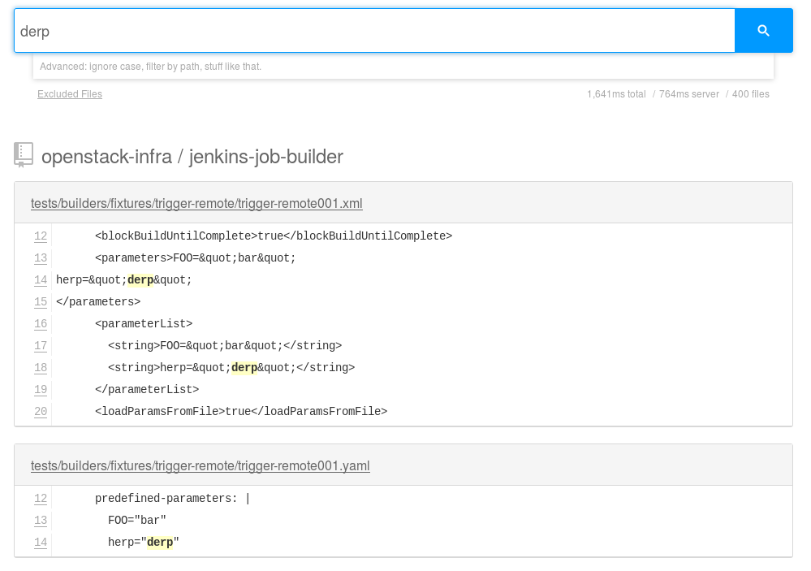
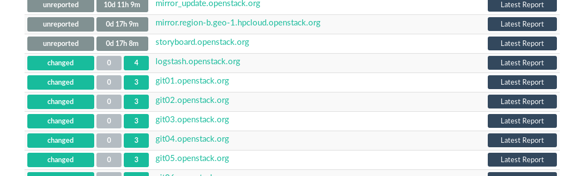

.. Secure Peer Networking with TINC slides file, created by
   hieroglyph-quickstart on Sun Nov 15 21:40:13 2015.

===================================
Better Together: Puppet and Ansible
===================================

Spencer Krum, IBM

Feb 2, 2016

@nibalizer

http://spencerkrum.com
https://git.openstack.org/cgit/openstack-infra/publications

.. note::

   * Who am I
   * What do I work on
   * github

Portland
========

Other People
============

* OpenStack Infra Team
* Jim Blair
* Monty Taylor
* Colleen Murphy
* Hunter Haugen
* Many More

.. note::

   * Team effort

Agenda
======

* Introduction
* Describe OpenStack Infra Team and Infrastructure
* Describe Puppet use
* Describe Ansible use
* Describe the Ansible-Puppet collaboration

OpenStack Infrastructure
========================

* General Overview

.. note::
    * OpenStack is software
    * We test it
    * 20k tests a day at peak times
    * Jobs, test, integration, docs, release, translate

History
=======

* Started 5 years ago
* Open Source

.. note::
    * pleia jim/monty sitck figures
    * pre ansible (python shop)
    * tried chef, hard
    * went with puppet
    * Heavy CI/CD culture, everything goes through git, delpoy - grafana

Primary Services
================

* Code Review (gerrit)
* CI (zomg complexity)
* Code hosting (haproxy/cgit farm)
* Mailing lists(mailman)

.. note::
    * These are the things that we really need to be up
    * Our CI system is home grown and awesome

Secondary Services
==================

* wiki
* ask.openstack.org
* mailing lists
* afs/kerberos
* irc bots
* paste
* etherpad
* elk
* zanata
* graphite/grafana/grafyaml

.. note::
    * These are the things that got set up
    * Lot of community involvment here

Codesearch
==========

* http://codesearch.openstack.org

.. note::
    * codesearch.openstack.org
    * hound from etsy
    * deployed by outreachy intern
    * use our puppet module!
    * wicked fast

Basics
======

* 30 'pets'
* 12 x jenkins masters
* 20 x package mirrors
* 8 x git mirrors
* ~30 elk cluster
* infinity test vms

.. note::
    * These are the things that got set up
    * Lot of community involvment here

Basics
======

* All infrastructure runs on OpenStack clouds
* Clouds donated by companies <3
* Rackspace and HPCloud at first
* Now involving BlueBox, OVH, Internap and more

.. note::
    * Maybe yours
    * HP has donated a blob of physical gear which we are clouding
    * Run our services on the public internet

Mgmt
====

* Precise, Trusty, Centos 7
* Puppet for config mgmt
* Ansible for orchestration
* Disk-image-builder for image builds
* snmp + cacti for metrics
* puppetboard for visibility

.. note::
    * Precise, trusty, centos 7
    * Centos 6 was killed
    * Puppet does all configuration of everything, services, files, templates, packages

Puppet circa 2014
=================

* 2.7 Master
* Passenger
* Generated certs, w/ push
* CI/CD
* install_modules.sh
* puppet-lint test
* some public modules
* single puppet repo

.. note::
    * Single puppetmaster
    * launch_node.py would build a machine w/ openstack apis and push in a puppet cert
    * near-perfect cd
    * install_modules.sh was sortof r10kish
    * public modules were all really old versions
    * public internet, rouge puppet certs

Example of where we were at
==========================

.. code-block:: shell

    if [ -n "$NODEPOOL_SSH_KEY" ] ; then
        puppet_install_users="install_users => false,
    ssh_key => '$NODEPOOL_SSH_KEY',"
    else
        puppet_install_users=""
    fi

    cat >/tmp/local.pp <<EOF
    class {'openstack_project::single_use_slave':
      sudo => $SUDO,
      thin => $THIN,
      install_resolv_conf => false,
      $puppet_install_users
    }
    EOF

    puppet apply /tmp/local.pp

.. note::
    * Some but not all of the terribleness has been preserved
    * run this in prod

Example of where we were at
==========================

.. code-block:: shell

    # upstream is currently looking for /run/systemd files to check
    # for systemd.  This fails in a chroot where /run isn't mounted
    # (like when using dib).  Comment out this confine as fedora
    # always has systemd
    #  see
    #   https://github.com/puppetlabs/puppet/pull/4481
    #   https://bugzilla.redhat.com/show_bug.cgi?id=1254616
    sudo sed -i.bak  \
    '/^[^#].*/ s|\(^.*confine :exists => \"/run/systemd/system\".*$\)|#\ \1|' \
    /usr/share/ruby/vendor_ruby/puppet/provider/service/systemd.rb

.. note::
    * Puppet 4 on f23
    * A user level patch to software that was patched before being packaged

Upgrades to the puppet setup
============================

* 3.x
* PuppetDB + PuppetBoard
* Modules split out
* Started using newer public modules
* Upgraded apache

.. note::
    * 3.x happened right as 2.7 Eol'd for the last time
    * launch_node.py would build a machine w/ openstack apis and push in a puppet cert
    * near-perfect cd
    * install_modules.sh was sortof r10kish
    * public modules were all really old versions

Upgrades to the puppet setup: Apply test
========================================

* Apply test http://git.openstack.org/cgit/openstack-infra/system-config/tree/tools/apply-test.sh

.. code-block:: shell

    file=$1
    fileout=${file}.out
    echo "##" > $fileout
    cat $file > $fileout
    sudo puppet apply --noop --verbose --debug $file >/dev/null 2>> $fileout
    ret=$?
    cat $fileout
    exit $ret

.. note::
    * 3.x happened right as 2.7 Eol'd for the last time
    * launch_node.py would build a machine w/ openstack apis and push in a puppet cert
    * near-perfect cd
    * install_modules.sh was sortof r10kish
    * public modules were all really old versions

Upgrades to the puppet setup: OpenStackCI
=========================================

* Control Repo Indirector
* Puppet module

.. note::
    * Open Source when you release
    * Open source when you get users
    * Wraps Daemons and configuration
    * All-in-one node deployment

Upgrades to the puppet setup: Public Hiera
==========================================

.. code-block:: shell

    commit 1624692402d2148ab7d6dd9e5642fb0b34ec7209
    Author: Spencer Krum <nibz@spencerkrum.com>
    Date:   Fri Apr 24 08:36:46 2015 -0700

        Convert hiera configuration to support public data
        
        This moves the hiera root under /opt/system-config so it can reach
        into both private and public hiera directories. This implies that
        hiera data will live in a hiera/ directory in system-config.
        
        Manual: This requires a manual change to the puppetmaster system. A
        rooter must move /etc/puppet/hieradata to /opt/system-config/hieradata
        
        Spec: http://specs.openstack.org/openstack-infra/infra-specs/specs/public_hiera.html
        
        Change-Id: I1736759ee9ac7cd0c206538ed0a2f6d0d71ea440

.. note::
    * Split Data from code
    * Increase visibility
    * Reduces merge conflicts

Need basic orchestration
========================

.. code-block:: shell

    commit b55ed05a274e5da40b567ad127a3d1c5808e48c6
    Author: Monty Taylor <mordred@inaugust.com>
    Date:   Mon Mar 17 04:01:33 2014 -0400

        Drive puppet from the master over ssh
        
        We'd like to be able to control sequencing of how and when puppet
        runs across our machines. Currently, it's just a set of agents
        that run kinda whenever they run. At times they hang and we don't
        know about it. Also, cross-server sequencing is impossible to
        achieve.
        
        Change the operation away from agents running on the machine as
        daemons, and instead ssh from the master to each machine.
        
        Change-Id: I76e41e63c6d0825e8735c484ba4580d545515e43

.. note::
    * /opt/config/production/run_all.sh
    * 'override hosts'
    * gave us limited Do X before Y
    * create repos in git slaves before creating them in the git master
    * replication in the git-master is a bit derpy
    * "this allows creation of git repos on the git slaves before creation of the master repos on the gerrit server"

Need basic orchestration
========================

.. code-block:: shell

    commit 034f37c32aed27d8000e1dc3a8a3d36022bcd12a
    Author: Monty Taylor <mordred@inaugust.com>
    Date:   Tue Apr 15 17:41:45 2014 -0700

        Use ansible instead of direct ssh calls
        
        Instead of a shell script looping over ssh calls, use a simple
        ansible playbook. The benefit this gets is that we can then also
        script ad-hoc admin tasks either via playbooks or on the command
        line. We can also then get rid of the almost entirely unused
        salt infrastructure.
        
        Change-Id: I53112bd1f61d94c0521a32016c8a47c8cf9e50f7

.. note::
    * Yes there was a ancient salt infra crusting

Puppet Inventory
================

.. code-block:: shell

    import json
    import subprocess

    output = [
        x.split()[1][1:-1] for x in subprocess.check_output(
            ["puppet","cert","list","-a"]).split('\n')
        if x.startswith('+')
    ]

    data = {
        '_meta': {'hostvars': dict()},
        'ungrouped': output,
    }
    print json.dumps(data, sort_keys=True, indent=2)

.. note::
    * Ansible dynamic inventory
    * Reads puppet cert --list --all

OpenStack Inventory
===================

.. code-block:: shell

    commit 714c934d0c57ed4c4ce653c0bb603071fc3dbff6
    Author: Monty Taylor <mordred@inaugust.com>
    Date:   Wed Nov 25 11:36:30 2015 -0500

        Use OpenStack for inventory instead of puppet
        
        With the puppetmaster not there anymore, we should consume inventory
        from OpenStack rather than from puppet.
        
        It turns out that because of the way static and dynamic inventories get
        merged, the static file needs to stand alone. SO - if you need to
        disable a dynamic host from OpenStack (pretty much all of our hosts) you
        need to not only add it to dynamic:children, you need to add an emtpy
        group into the static file too, otherwise you'll get an error like:
        
         root@puppetmaster:~# ansible -i newinv '!disabled' --list-hosts
         ERROR: newinv/static:4: child group is not defined: (jenkins-dev.openstack.org)
        
        Change-Id: Ic6809ed0b7014d7aebd414bf3a342e3a37eb10b6

.. note::
    * Ansible 2.0 released
    * Uses shade, a library we wrote
    * This inventory file lives in ansible/contrib
    * Start a really fucking annoying process of getting us the ability to disable a host temporarily

Ansible group membership
========================

.. code-block:: shell

    jenkins jenkins*.openstack.org
    logstash-worker ~logstash-worker\d+\.openstack\.org
    subunit-worker ~subunit-worker\d+\.openstack\.org
    elasticsearch ~elasticsearch0[1-7]\.openstack\.org
    git-loadbalancer ~git(-fe\d+)?\.openstack\.org
    disabled ci-backup-rs-ord.openstack.org:jenkins-dev.openstack.org
    git-server ~git\d+\.openstack\.org
    pypi pypi.*.openstack.org
    afsdb afsdb*.openstack.org
    afs afs*.*.openstack.org

    disabled ci-backup-rs-ord.openstack.org:jenkins-dev.openstack.org

Ansible's Role
==============

* Ad hoc
* Jenkins 'Maintenance'
* Upgrades (see references)
* Puppet Runs

.. note::
    * get it?
    * Upgraded our elasticsearch cluster using ansible, through code review

Jenkins Maintenance
===================

.. code-block:: yaml

    ---
    - hosts: 'jenkins0*.openstack.org'
      # Do the entire play completely for one host at a time
      serial: 1
      # Treat any errors as fatal so that we don't stop all the jenkins
      # masters.
      any_errors_fatal: true
      tasks:
        - shell: '/usr/local/jenkins/bin/safe_jenkins_shutdown --url https://{{ ansible_fqdn }}/ --user {{ user }} --password {{ password }}'
        - service: name=jenkins state=stopped
          # This is necessary because stopping Jenkins is not reliable.
          # We allow return code 1 which means no processes found.
        - shell: 'pkill -9 -U jenkins || [ $? -eq "1" ]'
        - service: name=jenkins state=restarted

.. note::
    * On cron once a week
    * This, and all ansible runs, run from one host, the puppetmaster
    * Bastion model

Run_all.sh
==========

.. code-block:: shell

    cd $SYSTEM_CONFIG
    git fetch -a && git reset -q --hard @{u}
    ./install_modules.sh
    ansible-galaxy install --force -r roles.yaml

    # First, sync the puppet repos with all the machines
    ansible-playbook -f 20 ${ANSIBLE_PLAYBOOKS}/update_puppet.yaml
    # Run the git/gerrit sequence, since it's important that they all work together
    ansible-playbook -f 10 ${ANSIBLE_PLAYBOOKS}/remote_puppet_git.yaml
    # Run AFS changes separately so we can make sure to only do one at a time
    # (turns out quorum is nice to have)
    ansible-playbook -f 1 ${ANSIBLE_PLAYBOOKS}/remote_puppet_afs.yaml
    # Run everything else. We do not care if the other things worked
    ansible-playbook -f 20 ${ANSIBLE_PLAYBOOKS}/remote_puppet_else.yaml

.. note::
    * Every 15 minutes by cron
    * Flocking in the cron, this can certainly take longer than 15 minutes 
    * Think about this relatively infrequently -> CI

Puppet + Ansible
================

* Copy code
* Copy secrets
* Inject variables
* Run puppet
* Save report
* Push to puppetdb

.. note::
    * no use of r10k or install_modules.sh
    * Code is rsyncd from the puppetmaster
    * Specific hiera files are pushed, this is controlled by ansible groups
    * Environment variables such as git refs are set using FACTER variables
    * puppet is run
    * report_file report processor runs, emits a json blob
    * json blob copied back to puppet master, curl'd at puppetdb

Copy code
=========

.. code-block:: yaml

    - block:
      - name: copy puppet modules
        synchronize:
          src: "{{ manifest_base }}/{{ puppet_environment }}"
          dest: "{{ manifest_base }}"

Copy secrets
============

.. code-block:: yaml

  - name: make file list
    puppet_get_hiera_file_list:
      fqdn: "{{ ansible_fqdn }}"
      groups: "{{ hostvars[inventory_hostname].group_names }}"
      location: "{{ hieradata }}/{{ puppet_environment }}"
    delegate_to: localhost
    register: hiera_file_paths

  - name: copy hiera files
    copy:
      src: "{{ item }}"
      dest: "{{ item }}"
      mode: 0600
    with_items: hiera_file_paths.paths|default()

Run Puppet
==========

.. code-block:: yaml

    - name: run puppet
      puppet:
        puppetmaster: "{{ puppetmaster|default(omit) }}"
        manifest: "{{ manifest|default(omit) }}"
        show_diff: "{{ show_diff|default(false) }}"
        facts: "{{ facts|default(omit) }}"
        facter_basename: "{{ facter_basename|default(omit) }}"

Post report and facts to puppetdb
==================================

.. code-block:: yaml

  - name: fetch file
    synchronize:
      mode: pull
      src: "{{ puppet_logfile }}"
      dest: /var/lib/puppet/reports/{{ ansible_fqdn }}

  - name: post facts
    puppet_post_puppetdb:
      puppetdb: "{{ puppetdb }}"
      hostvars: "{{ hostvars[inventory_hostname] }}"
      logfile: "{{ puppet_logfile }}"
      whoami: "{{ ansible_fqdn }}"
    delegate_to: localhost
    connection: local

PuppetBoard
===========

Next Steps
==========

* Shore up the puppetdb integration, has some bugs
* Move launch_node.py into ansible
* Remove puppet agent dependency for launch_node.py, disable puppetmaster service

References
==========

* All infra repos: http://git.openstack.org/cgit/openstack-infra/
* Main Control repo: http://git.openstack.org/cgit/openstack-infra/system-config
* ansible-puppet role: http://git.openstack.org/cgit/openstack-infra/system-config
* Apply test: http://git.openstack.org/cgit/openstack-infra/system-config/tree/tools/apply-test.sh
* OpenStack CI http://docs.openstack.org/infra/openstackci/
* Diskimage-Builder http://docs.openstack.org/developer/diskimage-builder/

References (cont)
=================

* ELK Upgrade Playbook: https://review.openstack.org/#/c/238185/
* Ansible puppetdb glue: http://git.openstack.org/cgit/openstack-infra/ansible-puppet/tree/library/puppet_post_puppetdb
* Json puppet report processor: http://git.openstack.org/cgit/openstack-infra/system-config/tree/modules/openstack_project/lib/puppet/reports/puppetdb_file.rb

References: shas
================

* Drive puppet from ssh: edaa31ebbda09fb03baf1d18b64f5fa996188745
* Move from ssh to ansible: 034f37c32aed27d8000e1dc3a8a3d36022bcd12a
* Public hiera: 1624692402d2148ab7d6dd9e5642fb0b34ec7209

Thank You
=========

Spencer Krum

IBM

@nibalizer

nibz@spencerkrum.com

https://git.openstack.org/cgit/openstack-infra/publications

